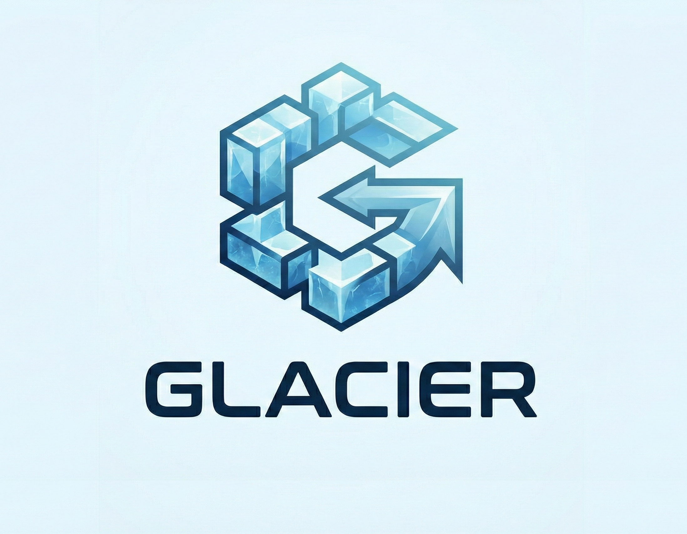

# <div align="center">Glacier</div>

<div align="center">

[](https://ziglang.org/)
[](https://github.com/M-Tesla/Glacier/actions/workflows/ci.yml)
[](LICENSE)
[]()
[]()

</div>

Glacier is an OLAP engine. A connection is a session of named catalogs (a Parquet/Avro file, an Iceberg Hadoop directory, a native Glacier warehouse, or an Iceberg REST Catalog). SQL talks `catalog.namespace.table`. You can run locally, over `https://`, on `s3://`, or on `gs://`. `glacier serve` is the process: Iceberg REST for other engines, Arrow Flight SQL for query. Results stream as record batches (Arrow C Data on the public ABI; Flight `DoGet` sends one FlightData per batch).

The query engine is Zig 0.16. Parquet, Avro, and in-memory Arrow are small C libraries (carquet, libavro, nanoarrow), not a from-scratch codec stack.

`glacier.version()` is **0.6.0**. That is the product number. `glacier.api_version()` stays `1` and a file path remains a one-catalog shortcut. 0.3 catalog session, 0.4 writes through the catalog, 0.5 `glacier serve`, and 0.6 streaming are this release. Linux `glacier-ui` is the same number. It was built and tested on **Linux**. The commands in this README are bash (`export`, `$ZIG`, `./zig-out/bin/glacier`, `libglacier.so`). They are not a Windows playbook; cmd/PowerShell, `.exe` / `.dll`, and paths will differ, and that path was not used here.

CI in this repo: `zig build test` on Linux and macOS; on Windows only `zig build` (compile, no test suite). Python tests and manylinux wheels (`manylinux_2_28` x86_64 and aarch64) run on Ubuntu. WASM on Ubuntu.

---

## Versions

| Number | Name | What is true |
| --- | --- | --- |
| **0.2.1** | Engine | Path to SQL to Arrow. Analysis SQL on Iceberg, Parquet, Avro. Linux wheel and Kof. |
| **0.3.x** | Catalog session | Named catalogs. `ATTACH` / `SHOW` / `USE` / `DETACH`. `catalog.namespace.table`. JOIN across catalogs. Iceberg is the table format, not the catalog. |
| **0.4.x** | Writes through the catalog | `CREATE` / `INSERT` / `CTAS` / `COPY FROM` / `DELETE` / `UPDATE` / `MERGE` / `ALTER ADD COLUMN` / `DROP`. Iceberg snapshots. Native `glacier` registry, Hadoop, REST `commitTable`. |
| **0.5.x** | Process | `glacier serve`: Iceberg REST (catalog port) and Arrow Flight SQL (query port). Two clients, same warehouse. Not in WASM or the wheel. |
| **0.6.x** | Streaming | Record batches on Flight `DoGet` and `Result.nextBatch`. `GLACIER_BATCH_ROWS` (default 65536). `glacier_result_arrow` still exports every row. Temp tables and cancel still next. `glacier.version()` prints **0.6.0**. Linux `glacier-ui` is this number. |

---

## Update v0.2

What 0.2 adds on top of 0.1 (the SQL surface that 0.1 froze and refused):

- **JOIN.** `LEFT` / `RIGHT` / `FULL JOIN … ON` (equalities, including `AND` of equalities). Null keys do not match. LEFT keeps every left row.
- **Predicates and scalars.** `LIKE`, `IN` (literals or uncorrelated `SELECT`), `BETWEEN`, `CASE WHEN … THEN … ELSE … END`, `SELECT NULL`.
- **Set and subquery.** `UNION` / `UNION ALL` (same schema), `FROM (SELECT …)`, `WITH t AS (SELECT …)`, scalar subquery in `WHERE` or in the select list, uncorrelated `EXISTS` / `NOT EXISTS`.
- **Window.** `ROWS` / `RANGE` frames (`UNBOUNDED PRECEDING` / `FOLLOWING`, `CURRENT ROW`, `N PRECEDING` / `FOLLOWING`), `LAG` / `LEAD`, window after `GROUP BY`.
- **Iceberg scan.** Position and equality deletes. Partition prune for `bucket[N]` / `year` / `month` / `day` / `hour` / `truncate[W]` / `void`, not only file bounds. Snapshot `schema-id` may differ from `current-schema-id` (promote int32→int64 / float32→float64; incompatible types error; new optional columns are null).
- **Parquet nested.** A LIST of primitives is utf8 (`[1, 2, 3]`). Flat STRUCT leaves are columns. Maps and nested lists stay rejected.
- **Python wheel.** `pip install glacier-olap` (`import glacier`). The wheel ships `libglacier.so` with zlib and zstd compiled in (no host `libz` / `libzstd`). CI builds `manylinux_2_28` for x86_64 and aarch64.
- **Kof JVM.** [`bindings/kof`](bindings/kof): `.kf` API plus Java/JNI on `glacier.h`, tested with Kof 0.4.9-beta. `SELECT 1` and parquet `COUNT(*)` on Linux.
- **SQL scalars and VALUES.** `lower` / `upper` (ASCII), `length` / `char_length`, `trim` / `ltrim` / `rtrim`, `replace`, `substr` / `substring`, `concat`, `left` / `right`, `starts_with` / `ends_with` / `contains`, `strpos`, `date_trunc`, `extract` / `year` / `month` / `day` / `hour` / `minute` / `second` (timestamp as epoch microseconds), `ceil` / `floor` / `sign`, `greatest` / `least`, `COUNT` / `SUM` / `AVG` / `MIN` / `MAX(DISTINCT col)`, `VALUES (…), (…)`, `GROUP BY` expressions.
- **Iceberg REST client.** `--catalog` loads tables through `GET /v1/config` and `loadTable`. Auth: none, bearer, OAuth2 client credentials, catalog SigV4. Vended S3/GCS keys from the table `config` map. `gs://` is HTTPS + Bearer.

Linux is still the tested path. `glacier.api_version()` is still `1`.

---

## Update v0.3

A connection is a session of named catalogs, not one path.

- **Names.** SQL talks `catalog.namespace.table`. Two levels when there is a default catalog (`USE`). One level is the file-path shortcut.
- **Adapters.** `files` (one Parquet/Avro/`.glacier` or one Iceberg table), `hadoop` (warehouse root), `glacier` (empty dir or `_glacier_catalog.json`), `iceberg_rest` (`http(s)://` that is not a data file).
- **SQL.** `SHOW CATALOGS` / `SHOW NAMESPACES` / `SHOW TABLES [FROM cat.ns]`, `DESCRIBE`, `USE cat[.ns]`, `ATTACH` / `DETACH`. `FROM glacier.catalogs` / `glacier.tables` / `glacier.snapshots` / `glacier.files` (Iceberg), also `t.snapshots` / `t.files`.
- **JOIN** across catalogs. Time travel stays `FROM t FOR SNAPSHOT …`. Remote `ATTACH` is refused in WASM.

---

## Update v0.4

Writes go through the catalog adapter. Iceberg is the default table format when Glacier creates a table. Iceberg is not the catalog.

- **SQL.** `CREATE NAMESPACE`, `CREATE TABLE` (columns or `AS SELECT`, optional `PARTITIONED BY` identity), `INSERT INTO … VALUES` / `SELECT`, `COPY t FROM 'file.parquet'` (also `.avro`, `.glacier`, `s3://`, `gs://`), `DELETE FROM t [WHERE …]` (equality deletes), `UPDATE` / `MERGE`, `ALTER TABLE t ADD COLUMN` (optional), `DROP TABLE`.
- **Where.** Native `glacier` and Hadoop commit `metadata.json` on the warehouse. REST writes data files to the table location (local, or a single PUT to `s3://` / `gs://`) and `commitTable` (assert snapshot; HTTP 409 if someone wrote first). The `files` catalog stays read-only.
- **WASM.** Remote `CREATE` / `INSERT` are refused.

---

## Update v0.5

`glacier serve` is the process, not a BI plugin.

- **Iceberg REST** on `http://127.0.0.1:8181`: `GET /v1/config`, namespaces, tables, `loadTable`, `commitTable`. Other engines point `type=rest` here.
- **Arrow Flight SQL** on `grpc://127.0.0.1:8815`: Handshake, `CommandStatementQuery`, `GetFlightInfo`, `DoGet`, `GetCatalogs`, `GetTables`. Each connection opens its own `Session` on the warehouse. Two Flight clients share snapshots: an `INSERT` is visible on the next connection.
- **Bind.** Localhost without TLS. A public bind without TLS is refused. `--listen` and `--flight` change the two ports. WASM and the Python wheel do not include `serve`. Remote Python over Flight is `adbc_driver_flightsql` later, not this wheel.

## Update v0.6

Flight `DoGet` and `Session` results stream more than one record batch.

- **Chunks.** Default 65536 rows (`GLACIER_BATCH_ROWS`). `Result.nextBatch` / `glacier_result_next_arrow` / Python `next_batch()` yield each chunk. Values across chunks match the full scan.
- **ABI v1.** `glacier_result_arrow` / `fetchall()` / `.arrow()` still export every row. `glacier.version()` is 0.6.0. Temp tables and query cancel are not this slice.

---

## What this tree does

- **SELECT.** `SELECT` (including `SELECT 1` / `SELECT NULL` with no table), `DISTINCT`, `GROUP BY` / `HAVING`, `ORDER BY` (several columns; nulls last on `ASC`), `LIMIT` / `OFFSET`. `GROUP BY` accepts expressions; a select expression that is not a group key uses the first row in the group.
- **Predicates.** `WHERE` with `AND` / `OR`, comparisons, `IS [NOT] NULL`, `LIKE`, `IN` (literals or uncorrelated `SELECT`), `BETWEEN`, scalar subquery, uncorrelated `EXISTS` / `NOT EXISTS`.
- **Set and subquery.** `UNION` / `UNION ALL` (same schema), `FROM (SELECT …)`, `WITH t AS (SELECT …)`, `VALUES (…), (…)` as a query or `FROM (VALUES …)`, scalar subquery in the select list (`SELECT (SELECT 1)`; zero rows is null, more than one row is an error).
- **JOIN.** `INNER` / `LEFT` / `RIGHT` / `FULL JOIN … ON` (equalities, including `AND` of equalities). Null keys do not match. LEFT keeps every left row. `COUNT(*)` after a JOIN counts matches from key frequencies; it does not build the joined rows. `WHERE`, `GROUP BY`, `COUNT(col)`, and other aggregates still join first.
- **Aggregates.** `COUNT` / `SUM` / `AVG` / `MIN` / `MAX` (`COUNT(*)` counts every row; the others skip nulls), `COUNT` / `SUM` / `AVG` / `MIN` / `MAX(DISTINCT col)`.
- **Window.** `COUNT` / `SUM` / `AVG` / `MIN` / `MAX` / `ROW_NUMBER` / `RANK` / `DENSE_RANK` / `LAG` / `LEAD` with `OVER ([PARTITION BY …] [ORDER BY …] [ROWS|RANGE …])`. Frames: `UNBOUNDED PRECEDING` / `FOLLOWING`, `CURRENT ROW`, `N PRECEDING` / `FOLLOWING`. `RANGE` offsets need a single numeric `ORDER BY`. Window after `GROUP BY` is allowed.
- **Scalars.** `abs`, `round`, `cast`, `coalesce`, `lower` / `upper` (ASCII), `length` / `char_length` (byte length), `trim` / `ltrim` / `rtrim` (ASCII space / tab / CR / LF), `replace` (all occurrences; empty search leaves the string unchanged), `substr` / `substring` (1-based), `concat`, `left` / `right`, `starts_with` / `ends_with` / `contains`, `strpos` / `instr` (1-based, 0 if missing), `date_trunc` (timestamp as epoch microseconds; units `year` / `month` / `day` / `hour` / `minute` / `second`), `extract` / `year` / `month` / `day` / `hour` / `minute` / `second` (`EXTRACT(HOUR FROM ts)` or `hour(ts)`), `ceil` / `ceiling` / `floor` / `sign`, `greatest` / `least` (skip nulls; all-null is null), `CASE WHEN … THEN … ELSE … END`.
- **COPY TO / FROM.** `COPY TO` writes a native `.glacier` file you can open again. `COPY t FROM 'file.parquet'` (also `.avro`, `.glacier`, `s3://`, `gs://`) scans the source and commits Iceberg data files through the catalog. It does not register the external file.
- **Formats.** Parquet (Snappy, GZIP, LZ4, ZSTD), Avro (null / deflate / snappy), Iceberg (`metadata.json` + Avro manifests). Optional Parquet columns are real SQL nulls. A LIST of primitives is utf8 (`[1, 2, 3]`, `["a"]`). Flat STRUCT leaves are ordinary columns. Maps and nested lists (`max_rep_level > 1`) are rejected.
- **Iceberg scan.** Prune uses column bounds and partition values (`identity`, `bucket[N]`, `year` / `month` / `day` / `hour`, `truncate[W]`, `void`; unknown transform is still rejected). Position and equality deletes (`content` 1 / 2) are applied on scan. `DELETE FROM t WHERE …` writes equality deletes through the catalog. `UPDATE` and `MERGE` commit one snapshot with equality deletes and new data files. Snapshot `schema-id` may differ from `current-schema-id` (promote int32 to int64 and float32 to float64; incompatible types error; new optional columns are null). Time travel: `FROM t FOR SNAPSHOT id` / `FOR SNAPSHOT AS OF id` / `FOR TIMESTAMP AS OF epoch_ms` (latest snapshot with `timestamp-ms <=` that value).
- **Access.** Local path, `http(s)://` Range GET, `s3://` (SigV4; `AWS_ACCESS_KEY_ID` / `AWS_SECRET_ACCESS_KEY` or `~/.aws/credentials`; `AWS_ENDPOINT_URL` for path-style), `gs://` (HTTPS + Bearer; `GOOGLE_OAUTH_ACCESS_TOKEN` / `GCS_OAUTH_TOKEN`, or a vended `gcs.oauth2.token`). Iceberg Hadoop-style directories open as a path. A warehouse root (`namespace/table/metadata`) is the `iceberg_hadoop` catalog (`SHOW NAMESPACES` / `FROM cat.ns.table`). If the table was copied, file URIs that still start with `metadata.location` are rewritten to the opened directory.
- **Catalog session.** A connection holds named catalogs. `open(path)` / `glacier_open(path)` registers `files` (one file or one Iceberg table), `hadoop` (a warehouse root), or `glacier` (an empty directory or `_glacier_catalog.json`). An `http(s)://` URI that is not a data file is an Iceberg REST Catalog (`rest`). `--catalog` / `glacier_open_catalog` / `ATTACH 'http://…' AS name` also register `iceberg_rest` (token in the C call, or `ICEBERG_TOKEN`). `ATTACH '/warehouse' AS name` registers `iceberg_hadoop` or, if the directory is empty or missing, the native `glacier` catalog. `SHOW CATALOGS`, `SHOW NAMESPACES`, `SHOW TABLES [FROM cat.ns]`, `DESCRIBE [TABLE] t`, `USE cat[.ns]`, `DETACH [CATALOG] name`. Writes on `glacier`, `iceberg_hadoop`, and `iceberg_rest`: `CREATE NAMESPACE`, `CREATE TABLE` (columns or `AS SELECT`, optional `PARTITIONED BY` identity), `INSERT INTO … VALUES` / `SELECT`, `COPY t FROM 'file.parquet'`, `DELETE FROM t [WHERE …]` (Iceberg equality deletes), `UPDATE t SET … [WHERE …]`, `MERGE INTO t USING u ON … WHEN MATCHED THEN DELETE | UPDATE SET … WHEN NOT MATCHED THEN INSERT`, `ALTER TABLE t ADD COLUMN` (optional), `DROP TABLE`. Native and Hadoop commit Iceberg on the warehouse (`metadata.json`). REST writes data files to the table location (local path, or a single PUT to `s3://` / `gs://`) and commits with `commitTable` (assert snapshot; HTTP 409 if someone wrote first). The `files` catalog stays read-only. `FROM catalog.namespace.table` and `JOIN` across catalogs. System tables: `glacier.catalogs`, `glacier.tables`, and (Iceberg only) `glacier.snapshots` / `glacier.files`, also as `t.snapshots` / `t.files`. Iceberg is the table format, not the catalog. Remote `ATTACH` and `CREATE` / `INSERT` are refused in WASM. Hadoop listing is local (no S3 ListBucket).
- **Memory.** Large scans stream. `ORDER BY` / `GROUP BY` / `DISTINCT` can spill under `GLACIER_MEM` (default 256 MiB) into `$GLACIER_TEMP`. `COUNT(*)` of a JOIN does not allocate the match rows. Query results split into record batches of `GLACIER_BATCH_ROWS` (default 65536).
- **How you call it.** CLI `glacier` (TUI on a Linux terminal, or `-c SQL`). `glacier-ui` is a Linux session workspace (catalog tree, SQL editor, result grid; `$ZIG build -Dui`; not in WASM or the wheel). `glacier serve [warehouse] [--listen 127.0.0.1:8181] [--flight 127.0.0.1:8815]` is the process: Iceberg REST Catalog on HTTP, Arrow Flight SQL on `grpc://` (native binary; not in WASM or the wheel). Handshake, `CommandStatementQuery`, `GetFlightInfo`, `DoGet` (one FlightData record batch after the schema, repeated), `GetCatalogs`, and `GetTables` talk to a `Session` in that process. Bind is localhost without TLS; a public bind without TLS is refused. Shared library `libglacier.so` on Linux + [`include/glacier.h`](include/glacier.h): `glacier_open` (file, warehouse, or REST URI), `glacier_open_catalog` (REST URI + warehouse + token), `glacier_query` (SQL, including `SHOW CATALOGS` / `ATTACH`), `glacier_result_arrow` (every row), `glacier_result_next_arrow` (next batch). Bindings on that header: Python (`pip install glacier-olap`, or `bindings/python` after a local `$ZIG build`), Kof JVM (`bindings/kof`), WASM (`$ZIG build wasm`), Node, Go, Rust. Remote Python over Flight is `adbc_driver_flightsql` later, not this wheel. `glacier.api_version()` is still `1`: a file path remains a one-catalog shortcut.

---

## What this tree does not do

`JOIN … USING` / `NATURAL` / comma-join, correlated subqueries, recursive `WITH`, named `WINDOW` clause, `GROUPS` frames. Azure Blob. ZSTD inside the WASM build (Snappy / GZIP / LZ4 work). A tested Windows (or native cmd) flow. Multipart object upload. Iceberg write transforms other than identity (`bucket` / `year` / `month` / `day` still prune on scan). Flight SQL prepared statements, JDBC metadata, SSO, or TLS. Temp tables and query cancel (rest of 0.6).

---

## Build (Linux)

Zig **0.16.0**. These are Linux shell commands.

```bash
export ZIG="$HOME/opt/zig-0.16/zig"   # or wherever 0.16 lives
$ZIG build
$ZIG build test
$ZIG build fixtures                  # tests/formats + tests/iceberg_prune
$ZIG build wasm                      # zig-out/bin/glacier.wasm
$ZIG build -Dui                      # glacier-ui (Linux session workspace; dvui + SDL3)
```

Output on Linux: `zig-out/bin/glacier`, `zig-out/lib/libglacier.so`, `zig-out/bin/glacier.wasm`. With `-Dui`: `zig-out/bin/glacier-ui`.

```bash
./zig-out/bin/glacier                              # TUI: pick a source, then SQL
./zig-out/bin/glacier tests/formats/sales.parquet  # SQL on that file
./zig-out/bin/glacier tests/formats/sales.parquet -c 'SELECT category, COUNT(*) GROUP BY category'
./zig-out/bin/glacier tests/formats/sales.parquet -c "SELECT lower(category), substr(category, 1, 2), COUNT(DISTINCT category) GROUP BY category"
./zig-out/bin/glacier tests/formats/sales.parquet -c "SELECT upper(category), length(category), SUM(DISTINCT price) WHERE EXISTS (SELECT 1)"
./zig-out/bin/glacier -c 'SELECT 1'
./zig-out/bin/glacier -c "SELECT (SELECT 1), year(0), replace('aba', 'a', 'z')"
./zig-out/bin/glacier -c "SELECT left('fruit', 2), ceil(1.2), greatest(1, 3, 2), hour(3661000000)"
./zig-out/bin/glacier -c 'SELECT * FROM (VALUES (1), (2))'
./zig-out/bin/glacier --catalog http://127.0.0.1:8181 --warehouse lake --token "$ICEBERG_TOKEN" \
  -c 'SELECT COUNT(*) FROM default.sales'
./zig-out/bin/glacier http://127.0.0.1:8181 -c 'SHOW CATALOGS'
./zig-out/bin/glacier -c "ATTACH 'tests/formats/sales.parquet' AS extra" \
  -c 'SHOW TABLES FROM extra' -c 'DESCRIBE extra' -c 'USE extra' -c 'SHOW TABLES'
./zig-out/bin/glacier /path/to/warehouse -c 'SHOW NAMESPACES' -c 'SELECT COUNT(*) FROM hadoop.sales.prune'
./zig-out/bin/glacier tests/iceberg_prune -c 'SELECT COUNT(*) FROM iceberg_prune FOR SNAPSHOT 1'
./zig-out/bin/glacier tests/iceberg_prune -c 'SELECT snapshot_id FROM glacier.snapshots'
./zig-out/bin/glacier -c "ATTACH '/tmp/mylake' AS lake" \
  -c "CREATE NAMESPACE lake.sales" \
  -c "CREATE TABLE lake.sales.orders (id BIGINT, category STRING)" \
  -c "INSERT INTO lake.sales.orders VALUES (1, 'fruit'), (2, 'veg')" \
  -c "DELETE FROM lake.sales.orders WHERE category = 'fruit'" \
  -c "UPDATE lake.sales.orders SET category = 'x' WHERE id = 1" \
  -c "ALTER TABLE lake.sales.orders ADD COLUMN note STRING" \
  -c "SELECT COUNT(*) FROM lake.sales.orders"
./zig-out/bin/glacier-ui                               # catalog tree + SQL + results
./zig-out/bin/glacier-ui tests/formats/sales.parquet   # open that file, SELECT * LIMIT 50
./zig-out/bin/glacier serve /tmp/mylake --listen 127.0.0.1:8181 --flight 127.0.0.1:8815
# catalog: --catalog http://127.0.0.1:8181
# query:   grpc://127.0.0.1:8815  (Flight SQL; two clients share the warehouse)
./zig-out/bin/glacier -c "ATTACH '/tmp/copylake' AS lake" \
  -c "CREATE NAMESPACE lake.sales" \
  -c "CREATE TABLE lake.sales.copied (id BIGINT, price BIGINT, category STRING) PARTITIONED BY (category)" \
  -c "COPY lake.sales.copied FROM 'tests/formats/sales.parquet'" \
  -c "SELECT COUNT(*) FROM lake.sales.copied WHERE category = 'fruit'"
```

---

## Python (Linux)

```bash
pip install glacier-olap
```

The PyPI name is `glacier-olap` because `glacier` is taken. `import glacier` is unchanged. The wheel includes `libglacier.so`; you do not need Zig to run queries. CI builds `manylinux_2_28` wheels; a GitHub Release publishes them to PyPI. Until that upload exists, install a CI artifact or the source checkout below.

From a source checkout:

```bash
$ZIG build -Doptimize=ReleaseFast
python3 -m pip install bindings/python
```

```python
import glacier

con = glacier.connect("tests/formats/sales.parquet")
con.execute("SELECT category, COUNT(*) AS n GROUP BY category").fetchall()
con.execute("SELECT * FROM glacier.catalogs").fetchall()  # [('files', 'files')]

# Iceberg REST Catalog (token also via ICEBERG_TOKEN)
# con = glacier.connect("http://127.0.0.1:8181")
# con = glacier.connect_catalog("http://127.0.0.1:8181", warehouse="lake", token="…")

n = glacier.connect("tests/formats/nulls.parquet")  # $ZIG build fixtures
n.execute("SELECT id WHERE qty IS NULL").fetchall()
```

`connect()` with no path is an empty session (`SELECT 1`, then `ATTACH`). `.arrow()` / `.df()` need pyarrow (and pandas for `.df()`). The connection is a catalog session; a parquet path is the one-table shortcut.

---

## Kof (Linux)

Tested on **Kof 0.4.9-beta**. The binding is still JVM JNI on `libglacier.so`: Kof `extern` binds scalar C symbols, not Arrow C Data. `Conn.kf` is what the compiler sees; at run time that class is Java JNI. Full notes: [`bindings/kof`](bindings/kof).

```kof
var c = Conn.connect()
assert(c.firstInt("SELECT 1") == 1)
c.close()

var sales = Conn.connect("tests/formats/sales.parquet")
assert(sales.firstInt("SELECT COUNT(*)") == 10)
sales.close()
```

```bash
export ZIG="$HOME/opt/zig-0.16/zig"
export KOF_HOME=/path/to/kof-0.4.9-beta-linux-x86_64
bindings/kof/run_tests.sh
```

`connect()` / `connect(path)` are overloads. `connectEmpty` / `connectPath` remain. Do not use `kof run` / `kof test` on this tree: they recompile the stub and drop the JNI class.

---

## WASM, Node, Go, Rust (Linux)

Same `glacier.h`. Build the shared library first (`$ZIG build -Doptimize=ReleaseFast`). WASM takes parquet bytes in memory (`bindings/wasm/example.html`); there is no filesystem in that build. The commands below are Linux.

```bash
$ZIG build wasm && node bindings/wasm/smoke.mjs
cd bindings/node && node-gyp rebuild && node test.mjs
cd bindings/go && go test
cd bindings/rust && cargo test
```

---

## What to expect next

**Rest of 0.6:** `CREATE TEMP TABLE`, query cancel. Then `api_version` 2 when a connection is a database session. The Windows test suite, Azure Blob, and parallel scan are not on that board.

Issues and CI live in this repo. `glacier.version()` is `0.6.0`; `glacier.api_version()` is `1`. A file path remains the one-catalog shortcut so ABI v1 clients keep working.

---

## License

MIT
